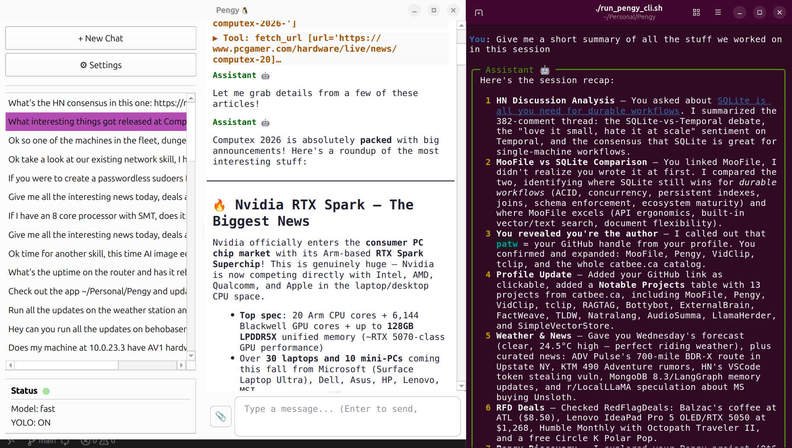

# PengyCPP 🐧

**A local-first AI agent with tools.** Desktop GUI, web UI, **and** command-line — all backed by the same agent core, talking to any OpenAI-compatible API. A pure C++17/Qt6 port of [Pengy](https://github.com/patw/pengy), sharing the same `~/.config/pengy/` data.

[](https://github.com/patw/PengyCPP/releases)
[](https://github.com/patw/PengyCPP/blob/main/LICENSE)

---

## What is PengyCPP?

PengyCPP is an LLM agent that runs on your own machine. It connects to OpenAI, Ollama, vLLM, Groq, OpenRouter, or any local endpoint, and gives the model a set of tools to operate on your filesystem, run code, search the web, and fetch URLs — all with your approval.

Three interfaces, one agent:

| **🐧 PengyCPP Desktop** | **🐧 PengyCPP CLI** | **🐧 PengyCPP Web** |
|---|---|---|
| Qt6 GUI with markdown rendering, multi-session sidebar, file attachments | Terminal REPL with slash commands, single-shot mode for scripting | QTcpServer web UI with Bootstrap, responsive layout, SSE live streaming |

All three share the same core — same tools, same chat history, same config. Use whichever fits your flow.

---

## Quick Start

### Download Pre-built Releases

Pre-built binaries are available on the [Releases page](https://github.com/patw/PengyCPP/releases):

| Platform | Format |
|----------|--------|
| **Linux** | `Pengy-x86_64.AppImage` (portable, no system deps) · `.deb` (Debian/Ubuntu) |
| **macOS** | `Pengy-macOS-<arch>.dmg` (arm64 / x86_64) |
| **Windows** | `Pengy-Windows.zip` (bundled Qt DLLs, unzip and run) |

### Linux — Build from Source

```bash
# Dependencies (Ubuntu/Debian)
sudo apt install build-essential cmake qt6-base-dev libgl-dev

# Build everything (GUI + CLI + Web)
./build_linux.sh

# GUI
./build/pengy

# CLI (interactive)
./build/pengy_cli

# CLI (single-shot)
./build/pengy_cli "What is the capital of France?"
./build/pengy_cli --no-save "quick question"

# Web UI
./build/pengy_web              # http://localhost:5000
./build/pengy_web 8080         # custom port
```

### Linux AppImage

```bash
# Download linuxdeploy tools first (one time):
wget -P appimage/tools https://github.com/linuxdeploy/linuxdeploy/releases/download/continuous/linuxdeploy-x86_64.AppImage
wget -P appimage/tools https://github.com/linuxdeploy/linuxdeploy-plugin-qt/releases/download/continuous/linuxdeploy-plugin-qt-x86_64.AppImage
chmod +x appimage/tools/*.AppImage

cd appimage && ./build.sh
# → Pengy-x86_64.AppImage
```

### Linux .deb

```bash
./build_deb.sh
# → pengy_<version>_amd64.deb
sudo dpkg -i pengy_<version>_amd64.deb
```

### macOS

```bash
brew install qt@6 cmake
./build_macos.sh [arm64|x86_64]
# → Pengy.app
# → Pengy-macOS-<arch>.dmg
```

### Windows

```
REM Prerequisites: Qt6 (MSVC 64-bit), VS Build Tools 2022, CMake
REM Run from a VS 2022 Developer Command Prompt:
build_windows.bat
REM → Pengy-Windows\pengy.exe  (Qt DLLs bundled)
```

---

## Features

- **OpenAI-compatible** — Works with OpenAI, Ollama, vLLM, LM Studio, OpenRouter, Groq, or any local endpoint
- **11 built-in tools** — Read, write, and edit files; run bash (with sudo support) and Python code; search the web and fetch URLs; explore directory trees and search codebases
- **Agentic workflow** — The LLM can call multiple tools per turn, chaining them to accomplish complex tasks
- **Tool confirmation** — Three modes: YOLO (All) skips all confirmations, Safe auto-approves read-only tools, None confirms everything
- **Context management** — Elide old tool results to save context window space; configurable per-chat
- **Token usage display** — See prompt/completion token counts after every turn (GUI sidebar)
- **Model discovery** — Fetch available models from your endpoint with one click or `/models` command
- **Multi-session** — Create, switch, and delete chat sessions; history saved locally as JSON; shared across all interfaces
- **File attachments** — GUI: attach files from the input bar, paste images from clipboard; CLI: use `@path` inline syntax
- **Image rendering** — Pasted and downloaded images display inline in the GUI
- **Chat export** — Export any chat to Markdown with one click (💾 button in sidebar)
- **Web UI** — Responsive Bootstrap interface served by a lightweight QTcpServer; SSE live streaming; works great on mobile
- **Slash commands** (CLI) — `/new`, `/load`, `/models`, `/yolo`, `/model`, `/list`, `/delete`, `/attach`, `/compact`, and more
- **Templated system message** — Auto-fills `{date}`, `{username}`, `{hostname}`, `{osinfo}` at send time
- **Persistent config** — Settings and chat history live in `~/.config/pengy/`, shared with all Pengy versions (Python, Rust, C++)
- **Cross-version interop** — Chats created in Python Pengy or PengyR load seamlessly in PengyCPP, and vice versa
- **Zero runtime dependencies** — Beyond system Qt6, no Python, no Rust, no third-party libraries required

---

## Screenshot



---

## Configuration

**Desktop:** Click ⚙ Settings in the sidebar.  
**CLI:** Run `/config` to view, `/model <name>` to switch models.  
**Web:** Click ⚙ in the top-right navbar.

| Setting | Description |
|---------|-------------|
| Base URL | API endpoint (e.g. `http://localhost:11434/v1` for Ollama) |
| API Key | Your API key (or anything for local endpoints) |
| Model | Model name, e.g. `gpt-4o`, `llama3`, `gemma` |
| System Message | Supports `{date}`, `{username}`, `{hostname}`, `{osinfo}` placeholders |
| Tool Confirmation | YOLO (All) / Safe Only / None — controls which tools require approval |
| UI Scale (GUI) | 75 / 100 / 125 / 200 % — takes effect on next launch |

---

## Tools

PengyCPP gives the LLM these tools to operate on your machine:

| Tool | Description |
|------|-------------|
| `read_file` / `read_multiple_files` | Read one or more files at once |
| `write_file` | Write or overwrite a file |
| `replace_in_file` | Targeted text replacement (safer than full rewrites) |
| `run_bash` | Execute shell commands (configurable timeout; sudo password dialog; process-group kill on timeout) |
| `run_python` | Execute Python code (uses system `python3`) |
| `web_search` | DuckDuckGo web search (via `QNetworkAccessManager`) |
| `download_file` | Download a URL to `~/Downloads/` |
| `fetch_url` | Fetch a URL's text content into context |
| `directory_tree` | Visual directory structure listing |
| `search_content` | Regex search across files in a codebase |

---

## Skills

The 11 built-in tools cover the basics, but PengyCPP is designed to be extended with **skills** — your own custom instructions and scripts stored as plain markdown files.

Skills are not a plugin system. There is no SDK, no manifest file, no packaging. A skill is just a `skillname/skillname_skill.md` file with instructions PengyCPP can read, optionally backed by a bash or Python script. You point PengyCPP at a directory of these, and it uses them automatically.

This means your PengyCPP can do whatever you need it to:
- Fetch weather from an API
- Control devices on your home network
- Query your local databases
- Generate reports from your own data
- Run system administration tasks
- Send notifications, emails, or messages
- Anything you can describe in a prompt and a script

Skills are also self-authoring — you can ask PengyCPP to create new skills for you, write the markdown, write the script, and update the skill index, all in one conversation.

**📖 Read the full guide:** [`skills/README.md`](https://github.com/patw/Pengy/blob/main/skills/README.md) — covers the philosophy, how skills work, 4 complete examples with code, how to make your own, and a call to action to build your first skill.

---

## API Compatibility

| Service | Base URL |
|---------|----------|
| OpenAI | `https://api.openai.com/v1` |
| Ollama | `http://localhost:11434/v1` |
| LM Studio | `http://localhost:1234/v1` |
| vLLM | `http://localhost:8000/v1` |
| OpenRouter | `https://openrouter.ai/api/v1` |
| Groq | `https://api.groq.com/openai/v1` |

---

## Architecture

PengyCPP is a **single CMake project** — no Rust, no Python, no FFI. All logic lives in pure C++17:

| Module | What |
|--------|------|
| `config` | Load/save `~/.config/pengy/settings.json`; render system message templates |
| `chatmanager` | Chat CRUD, `~/.config/pengy/chats.json`, message cleaning, context elision |
| `tools` | 11 tools using `QFile`, `QProcess`, `QNetworkAccessManager`, `QDirIterator` |
| `llmclient` | Blocking OpenAI-compatible chat loop via `QNetworkAccessManager` + local `QEventLoop` |
| `chatworker` | Runs `LlmClient::run()` on a `QThread`; `QWaitCondition` for tool confirmation (zero-CPU wait) |
| `webchatworker` | Same as chatworker but for `pengy_web`; emits SSE events via Qt signals |
| `webserver` | `QTcpServer` HTTP server with SSE push; Bootstrap 5 UI from Qt Resources |
| `mainwindow` | Three-pane window; tool confirmation modal; wires all signals/slots |
| `chathistory` | Sidebar with per-row 💾 (export to Markdown) and 🗑 (delete) buttons |
| `chatview` | `QTextBrowser` with custom markdown→HTML pipeline (fenced code, tables, inline code, bold/italic) |

Three binaries (`pengy`, `pengy_cli`, `pengy_web`) share the same config and chat storage. No runtime dependencies beyond system Qt6.

---

## Project Structure

```
PengyCPP/
├── CMakeLists.txt          # Single CMake project — builds pengy, pengy_cli, pengy_web, pengy_tests
├── main.cpp                # Desktop GUI entry point
├── config.cpp/h            # Settings: ~/.config/pengy/settings.json
├── chatmanager.cpp/h       # Chats: ~/.config/pengy/chats.json
├── tools.cpp/h             # 11 OpenAI function-calling tools
├── llmclient.cpp/h         # Blocking LLM chat loop (QNetworkAccessManager)
├── chatworker.cpp/h        # QThread worker + QWaitCondition confirmation
├── mainwindow.cpp/h        # Three-pane main window
├── chathistory.cpp/h       # Sidebar — chat list with 💾/🗑 buttons
├── chatview.cpp/h          # Chat display — markdown, tables, collapsible tool blocks
├── chatinput.cpp/h         # Message input
├── settingsdialog.cpp/h    # Settings dialog + Fetch Models
├── cli/
│   └── main.cpp            # Interactive REPL + single-shot mode
├── web/
│   ├── main.cpp            # Web server entry point (default port 5000)
│   ├── webserver.cpp/h     # QTcpServer HTTP + SSE server
│   ├── webchatworker.cpp/h # QThread worker for web (mirrors chatworker)
│   ├── web_resources.qrc   # Embeds HTML templates into binary
│   └── templates/
│       ├── chat.html       # Bootstrap 5 chat UI with SSE
│       └── settings.html   # Settings form
├── tests.cpp               # Qt Test suite (60+ tests)
├── appimage/
│   ├── build.sh            # Bundles Pengy-x86_64.AppImage
│   └── pengy.desktop       # Desktop entry
├── build_linux.sh          # Linux native build
├── build_macos.sh          # macOS build + Pengy.app + DMG
├── build_windows.bat       # Windows build (MSVC Qt6)
├── build_deb.sh            # Debian/Ubuntu .deb package
└── SPEC.md                 # Full architecture specification
```

---


## Interoperability

PengyCPP shares the same `~/.config/pengy/` directory as Python Pengy and PengyR:
- **`settings.json`** — Same format, all versions read/write it
- **`chats.json`** — Same message schema. Chats created in any version load in any other

---

## Development

### Build from source

```bash
git clone https://github.com/patw/PengyCPP.git
cd PengyCPP

# Build all three binaries
cmake -B build -DCMAKE_BUILD_TYPE=Release
cmake --build build -j$(nproc)

# Run GUI
./build/pengy

# Run CLI
./build/pengy_cli                     # interactive REPL
./build/pengy_cli "what is 2+2"      # single-shot

# Run Web UI
./build/pengy_web                     # http://localhost:5000
./build/pengy_web 8080               # custom port

# Run tests
cmake --build build --target pengy_tests
./build/pengy_tests

# Format code
clang-format -i *.cpp *.h cli/*.cpp web/*.cpp web/*.h
```

---

## Dependencies

| Dependency | Purpose |
|---|---|
| Qt6::Core | Foundation: `QFile`, `QDir`, `QJson*`, `QProcess`, `QRegularExpression` |
| Qt6::Widgets | GUI: `QMainWindow`, `QListWidget`, `QTextBrowser`, `QSplitter`, dialogs |
| Qt6::Network | HTTP: `QNetworkAccessManager`, `QNetworkReply` |
| C++17 compiler | `std::function`, `std::pair`, `std::atomic`, structured bindings |
| CMake ≥ 3.16 | Build system |

**No Rust, no Python, no third-party C++ libraries.** Everything is Qt6 + STL.

---

## Also Available

PengyCPP is the **highest-performance edition** of Pengy — smallest binary, lowest memory footprint, zero external dependencies beyond Qt6. All editions share the same `~/.config/pengy/` data and are fully interoperable:

| Edition | Language | Notes |
|---------|----------|-------|
| [**Pengy**](https://github.com/patw/Pengy) | Python | Reference implementation — easiest to hack on |
| [**PengyR**](https://github.com/patw/PengyR) | Rust + Qt6 | High-performance native binary, statically-linked core |
| [**PengyCPP**](https://github.com/patw/PengyCPP) | C++17 + Qt6 | Highest performance, smallest memory footprint, zero external dependencies |

All three offer the same 11 tools, three interfaces (GUI/CLI/Web), and full chat interop.

---

## License

MIT
