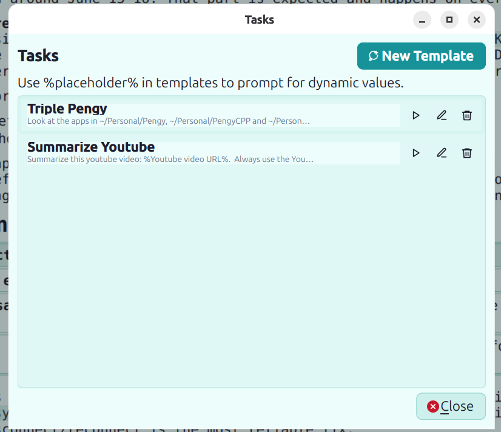

# PengyCPP 🐧

**A local-first AI agent with tools.** Desktop GUI, web UI, **and** command-line — all backed by the same agent core, talking to any OpenAI-compatible API. A pure C++17/Qt6 port of [Pengy](https://github.com/patw/pengy), sharing the same `~/.config/pengy/` data.

[](https://github.com/patw/PengyCPP/releases)
[](https://github.com/patw/PengyCPP/blob/main/LICENSE)

---

## What is PengyCPP?

PengyCPP is an LLM agent that runs on your own machine. It defaults to a **local server** — Ollama's OpenAI-compatible port — and also speaks to llama.cpp, vLLM, LM Studio, or any hosted OpenAI-compatible API (OpenAI, Groq, OpenRouter). It gives the model 16 built-in tools to operate on your filesystem, inspect images, run code, search the web, and more — all with your approval.

Three interfaces, one agent:

| **🐧 PengyCPP Desktop** | **🐧 PengyCPP CLI** | **🐧 PengyCPP Web** |
|---|---|---|
| Qt6 GUI with markdown rendering, sidebar with history & quick settings, file attachments | Terminal REPL with slash commands, single-shot mode for scripting | QTcpServer web UI with Bootstrap, responsive layout, SSE live streaming |

All three share the same core — same tools, same chat history, same config. Use whichever fits your flow.

---

## Quick Start

### Download Pre-built Releases

Pre-built binaries are on the [Releases page](https://github.com/patw/PengyCPP/releases):

| Platform | Format |
|----------|--------|
| **Linux** | `Pengy-x86_64.AppImage` (portable) · `.deb` (Debian/Ubuntu) |
| **macOS** | `Pengy-macOS-<arch>.dmg` (arm64 / x86_64) |
| **Windows** | `Pengy-Windows-<version>.msi` (per-user installer, no admin needed) · `Pengy-Windows-<version>.zip` (portable) |

### Linux — Build from Source

```bash
# Dependencies
sudo apt install build-essential cmake qt6-base-dev libgl-dev

# Build everything (GUI + CLI + Web)
./build_linux.sh

# GUI
./build/pengy

# CLI
./build/pengy-cli                                              # interactive
./build/pengy-cli "What is the capital of France?"             # single-shot

# Web
./build/pengy-web                                              # http://localhost:5000
```

The web UI is for single-user personal use. For remote access, put it behind nginx with SSL; use `--trusted-host` to set the public hostname when reverse-proxying.

---

## Features

- **Local-first** — Defaults to a local Ollama endpoint (no API key, no account). Also works with llama.cpp, vLLM, LM Studio, OpenRouter, Groq, OpenAI, or any OpenAI-compatible endpoint
- **16 built-in tools** — Read files and inspect images; write and edit files transactionally; run bash and Python; search the web; explore and glob your filesystem; track multi-step ops with structured to-do lists; ask clarifying questions
- **Agentic workflow** — The LLM chains multiple tool calls per turn to accomplish complex tasks
- **Tool confirmation** — Three modes: auto-approve everything, auto-approve read-only tools only, or confirm every call
- **Theme system** — System/light/dark modes plus 8 accent colours; fonts scale with the UI
- **Tasks** — Reusable prompt templates with `%placeholder%` tokens for repeat workflows
- **Model discovery** — Fetch available models from your endpoint with one click
- **File attachments** — GUI: attach files or paste images; CLI: `@path` syntax
- **Image rendering** — Pasted and downloaded images display inline in the GUI
- **Chat export** — Export any chat to Markdown with one click
- **Templated system message** — Auto-fills `{date}`, `{username}`, `{hostname}`, `{osinfo}`
- **Cross-version interop** — Chats created in Python Pengy or PengyR load seamlessly in PengyCPP
- **Zero runtime dependencies** — No Python, no Rust, no third-party libraries beyond system Qt6

---

## Screenshots

| Main chat UI | Settings / theme controls | Tasks templates |
|---|---|---|
|  |  |  |

---

## Configuration

**Desktop:** Click ⚙ Settings in the sidebar.  
**CLI:** Run `/config` to view, `/model <name>` to switch models.  
**Web:** Click ⚙ in the top-right navbar.

**The default endpoint is local:** `http://127.0.0.1:11434/v1` — Ollama's
OpenAI-compatible port, which needs **no API key**. There is deliberately **no
default model**, because a local server ships none of its own (a fresh
`ollama list` is empty); naming one would just fail on your first message.

```bash
ollama serve                  # if it is not already running
ollama pull llama3.2          # any model you like
/models                       # list what the endpoint offers
/model llama3.2               # select one
```

Until a model is selected, Pengy says so and tells you how — it never sends an
empty model name to the endpoint. Using a different server or a hosted API? Point
Pengy at it once and it is remembered:

```bash
/baseurl http://127.0.0.1:8080/v1     # llama.cpp, vLLM, LM Studio, …
/baseurl https://api.openai.com/v1    # or a hosted API…
/apikey sk-...                        # …which needs a key
```

The same settings live in Settings in the GUI and the Web UI.

| Setting | Description |
|---------|-------------|
| Base URL | API endpoint — defaults to `http://127.0.0.1:11434/v1` (Ollama) |
| API Key | Your API key (or anything for local endpoints) |
| Model | Model name, e.g. `llama3.2`, `qwen3:8b`, `gemma3` — **no default**, see below |
| System Message | Supports `{date}`, `{username}`, `{hostname}`, `{osinfo}` placeholders |
| Tool Confirmation | All / Safe / None — which tools require approval |
| Theme Mode (GUI) | System / Light / Dark — follows OS palette |
| Accent Color (GUI) | Default, Blue, Teal, Green, Orange, Red, Pink, or Purple |
| UI Scale (GUI) | 75–200% — restart for full native-widget scaling |

---

## Tasks

Tasks are reusable prompt templates for workflows you repeat often — summarizing a YouTube video, drafting a release note, or running a code-review checklist. Open **Tasks** from the desktop sidebar to create, edit, delete, or play templates.

Use `%placeholder%` tokens anywhere in the template to ask for values when the task is played:

```text
Summarize this YouTube video: %Youtube Video URL%
Always use the youtube transcription skill.
```

When you hit **▶ Play**, PengyCPP collects each placeholder once, renders the full prompt, and sends it through the normal chat pipeline. Tasks live in `~/.config/pengy/tasks.json`, shared across all interfaces and editions.

---

## Tools

PengyCPP gives the LLM these 16 tools to operate on your machine (17 on Windows, which adds `run_powershell`):

| Tool | Description |
|------|-------------|
| `read_file` / `read_multiple_files` | Read one or more files at once |
| `read_image` | Inspect a local image, screenshot, photo, diagram, or chart |
| `apply_changes` | Transactional multi-file exact-text edits with a dry-run diff |
| `write_file` | Write or overwrite a file |
| `replace_in_file` | Targeted text replacement (safer than full rewrites) |
| `run_bash` | Execute shell commands locally or on a remote host over ssh (configurable timeout; sudo support, including remote sudo). On Windows, remote hosts only |
| `run_powershell` | Windows only: run PowerShell scripts locally (PowerShell 7 if installed, else Windows PowerShell 5.1), with the privileges Pengy was started with |
| `run_python` | Execute Python code |
| `web_search` | DuckDuckGo web search |
| `download_file` | Download a URL to `~/Downloads/` |
| `fetch_url` | Fetch a URL's text content into context |
| `directory_tree` | Visual directory structure listing |
| `search_content` | Regex search across files in a codebase |
| `glob` | File pattern matching — respects `.gitignore`-style skips |
| `todowrite` | Structured task list for tracking multi-step operations |
| `ask_user_question` | Multi-choice questions to clarify vague requests |

---

## Skills

The 16 built-in tools cover the basics, but PengyCPP is designed to be extended with **skills** — local instruction files with optional helper scripts.

A local skill normally has a `skillname/skillname_skill.md` instruction file, optionally backed by a bash or Python helper. Put installed skills under `~/skills/` and list them in `skill_index.md`; Pengy's system instructions tell it to consult that index and read the selected skill before acting. For reusable packages, [BotSkills](https://skills.catbee.ca) lets you inspect a skill, download its ZIP, and review its manifest and helper scripts before installing it.

This means your PengyCPP can do whatever you need it to:
- Fetch weather from an API
- Control devices on your home network
- Query your local databases
- Generate reports from your own data
- Run system administration tasks
- Send notifications, emails, or messages
- Anything you can describe in a prompt and a script

Skills are also self-authoring — ask PengyCPP to create one for you, and it writes the markdown, writes the script, and updates the index, all in one conversation.

**📖 Start with [BotSkills](https://skills.catbee.ca) or read the full guide:** [`skills/README.md`](https://github.com/patw/Pengy/blob/main/skills/README.md) — covers the philosophy, how skills work, 4 complete examples, and how to make your own.

---

## API Compatibility

| Service | Base URL |
|---------|----------|
| OpenAI | `https://api.openai.com/v1` |
| Ollama | `http://127.0.0.1:11434/v1` |
| LM Studio | `http://localhost:1234/v1` |
| vLLM | `http://localhost:8000/v1` |
| OpenRouter | `https://openrouter.ai/api/v1` |
| Groq | `https://api.groq.com/openai/v1` |

---

## Development

### Architecture

PengyCPP is a **single CMake project** — no Rust, no Python, no FFI. All logic lives in pure C++17:

| Module | What |
|--------|------|
| `config` | Load/save settings.json; render system message templates |
| `chatmanager` | Chat CRUD, message cleaning, context elision |
| `taskmanager` | Task template CRUD, `%placeholder%` extraction/rendering |
| `themehelper` | System/light/dark mode, accent palette, UI-scale helpers |
| `tools` | 16 tools using QFile, QProcess, QNetworkAccessManager |
| `llmclient` | Blocking OpenAI-compatible chat loop |
| `chatworker` | QThread worker with QWaitCondition for tool confirmation |
| `webserver` | QTcpServer HTTP server with SSE push; Bootstrap 5 UI |
| `mainwindow` | Three-pane window with tool confirmation modal |

Three binaries (`pengy`, `pengy-cli`, `pengy-web`) share the same config and chat storage. No runtime dependencies beyond system Qt6.

### Project structure

```
PengyCPP/
├── CMakeLists.txt          # Single CMake project
├── main.cpp                # Desktop GUI entry point
├── *.cpp/*.h               # Core: config, chat, tasks, tools, UI modules
├── cli/main.cpp            # CLI entry point
├── web/                    # Web server + templates
└── appimage/               # AppImage bundling scripts
```

### Build from source

```bash
git clone https://github.com/patw/PengyCPP.git && cd PengyCPP
cmake -B build -DCMAKE_BUILD_TYPE=Release
cmake --build build -j$(nproc)

./build/pengy               # GUI
./build/pengy-cli           # CLI
./build/pengy-web           # Web (http://localhost:5000)

# Run tests
cmake --build build --target pengy_tests
./build/pengy_tests
```

### Dependencies

| Dependency | Purpose |
|---|---|
| Qt6::Core | Foundation: QFile, QDir, QJson, QProcess |
| Qt6::Widgets | GUI: QMainWindow, QTextBrowser, QSplitter, dialogs |
| Qt6::Network | HTTP: QNetworkAccessManager |
| C++17 compiler | `std::function`, `std::atomic`, structured bindings |
| CMake ≥ 3.16 | Build system |

**No Rust, no Python, no third-party C++ libraries.** Everything is Qt6 + STL.

---

## Interoperability

PengyCPP shares `~/.config/pengy/` with Python Pengy and PengyR:
- **`settings.json`** — Same format, all versions read/write it
- **`chats.json`** — Same message schema. Chats created in any version load in any other
- **`tasks.json`** — Shared prompt-template library

---

## Also Available

| Edition | Language | Notes |
|---------|----------|-------|
| [**Pengy**](https://github.com/patw/Pengy) | Python | Reference implementation — easiest to hack on |
| [**PengyR**](https://github.com/patw/PengyR) | Rust + Qt6 | High-performance native binary, statically-linked core |
| [**PengyCPP**](https://github.com/patw/PengyCPP) | C++17 + Qt6 | Highest performance, smallest memory footprint, zero external dependencies |

All three offer the same 16 tools, durable image attachments, desktop theme controls, reusable task templates, three interfaces (GUI/CLI/Web), and full chat/task interop.

---

## Documentation

- [Configuration reference](docs/configuration.md) — all settings.json fields explained
- [Reverse proxy setup](docs/reverse-proxy.md) — nginx, Caddy, SSH tunnels, Docker
- [Skills deep-dive](docs/skills.md) — skill patterns, `~/.secrets`, `uv` dependencies
- [API compatibility](docs/api-compatibility.md) — provider support, model discovery, local endpoints
- [FAQ](docs/faq.md) — common questions and troubleshooting
- [Building from source](docs/building.md) — platform-specific build instructions
- [Changelog](CHANGELOG.md) — version history

## License

MIT
