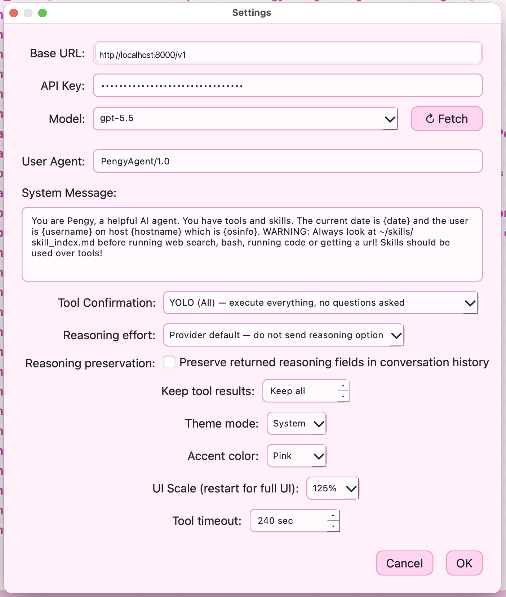
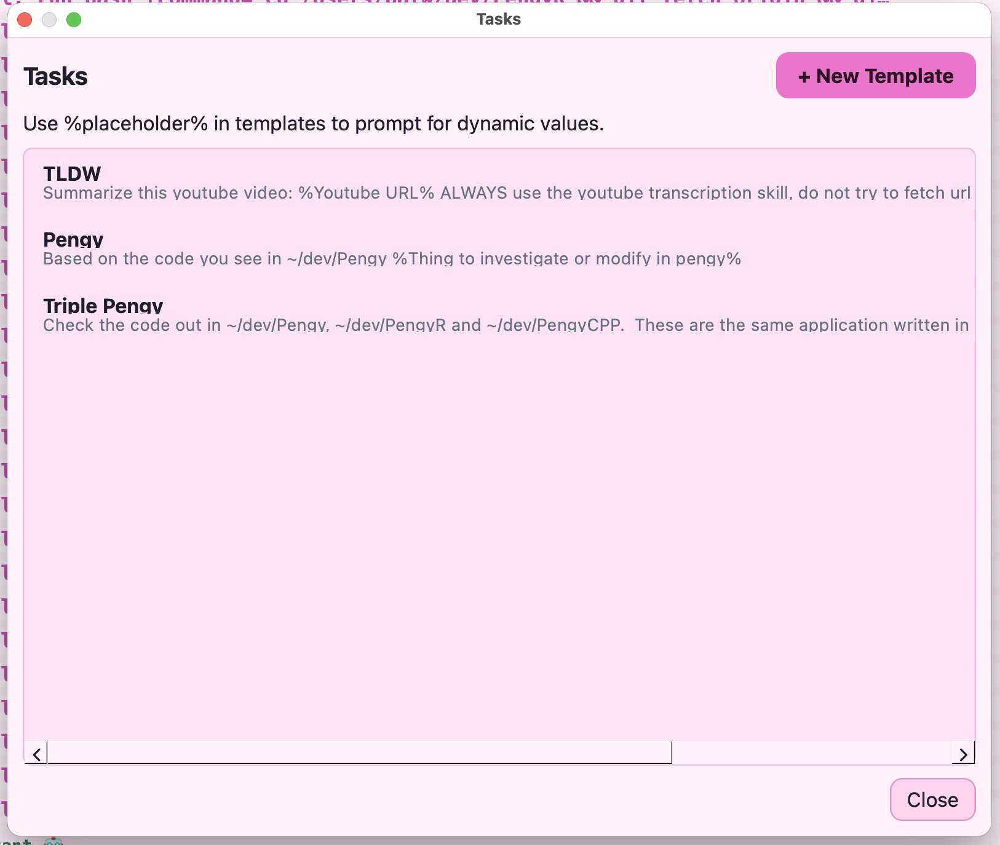

# PengyCPP 🐧

**A local-first AI agent with tools.** Desktop GUI, web UI, **and** command-line — all backed by the same agent core, talking to any OpenAI-compatible API. A pure C++17/Qt6 port of [Pengy](https://github.com/patw/pengy), sharing the same `~/.config/pengy/` data.

[](https://github.com/patw/PengyCPP/releases)
[](https://github.com/patw/PengyCPP/blob/main/LICENSE)

---

## What is PengyCPP?

PengyCPP is an LLM agent that runs on your own machine. It connects to OpenAI, Ollama, vLLM, Groq, OpenRouter, or any local endpoint, and gives the model a set of tools to operate on your filesystem, run code, search the web, and fetch URLs — all with your approval.

Three interfaces, one agent:

| **🐧 PengyCPP Desktop** | **🐧 PengyCPP CLI** | **🐧 PengyCPP Web** |
|---|---|---|
| Qt6 GUI with markdown rendering, multi-session sidebar, file attachments | Terminal REPL with slash commands, single-shot mode for scripting | QTcpServer web UI with Bootstrap, responsive layout, SSE live streaming |

All three share the same core — same tools, same chat history, same config. Use whichever fits your flow.

---

## Quick Start

### Download Pre-built Releases

Pre-built binaries are available on the [Releases page](https://github.com/patw/PengyCPP/releases):

| Platform | Format |
|----------|--------|
| **Linux** | `Pengy-x86_64.AppImage` (portable, no system deps) · `.deb` (Debian/Ubuntu) |
| **macOS** | `Pengy-macOS-<arch>.dmg` (arm64 / x86_64) |
| **Windows** | `Pengy-Windows.zip` (bundled Qt DLLs, unzip and run) |

### Linux — Build from Source

```bash
# Dependencies (Ubuntu/Debian)
sudo apt install build-essential cmake qt6-base-dev libgl-dev

# Build everything (GUI + CLI + Web)
./build_linux.sh

# GUI
./build/pengy

# CLI (interactive)
./build/pengy_cli

# CLI (single-shot)
./build/pengy_cli "What is the capital of France?"
./build/pengy_cli --no-save "quick question"

# Web UI
./build/pengy_web              # http://localhost:5000
./build/pengy_web --port 8080  # custom port
```

### Linux AppImage

```bash
# Download linuxdeploy tools first (one time):
wget -P appimage/tools https://github.com/linuxdeploy/linuxdeploy/releases/download/continuous/linuxdeploy-x86_64.AppImage
wget -P appimage/tools https://github.com/linuxdeploy/linuxdeploy-plugin-qt/releases/download/continuous/linuxdeploy-plugin-qt-x86_64.AppImage
chmod +x appimage/tools/*.AppImage

cd appimage && ./build.sh
# → Pengy-x86_64.AppImage
```

### Linux .deb

```bash
./build_deb.sh
# → pengy_<version>_amd64.deb
sudo dpkg -i pengy_<version>_amd64.deb
```

### macOS

```bash
brew install qt@6 cmake
./build_macos.sh [arm64|x86_64]
# → Pengy.app
# → Pengy-macOS-<arch>.dmg
```

### Windows

```
REM Prerequisites: Qt6 (MSVC 64-bit), VS Build Tools 2022, CMake
REM Run from a VS 2022 Developer Command Prompt:
build_windows.bat
REM → Pengy-Windows\pengy.exe  (Qt DLLs bundled)
```

---

## Web UI

```bash
# Localhost only (default)
./build/pengy_web

# Listen on all interfaces — LAN, Docker, media server
./build/pengy_web --host 0.0.0.0

# Custom port
./build/pengy_web --port 8080 --host 0.0.0.0

# Behind a reverse proxy, when Pengy stays on loopback
./build/pengy_web --trusted-host pengy.example
```

The web UI is designed for single-user personal use. For remote access, put it behind nginx with SSL and HTTP basic auth — Pengy itself has no authentication.

### Reverse proxies and `--trusted-host`

Pengy Web rejects requests whose `Origin` doesn't match the host they were sent to, which blocks CSRF, and — when bound to loopback — rejects unexpected `Host` headers, which blocks DNS rebinding. Both attacks come from your own browser, so a loopback bind alone does not stop them.

That last check needs help in one specific case: **a reverse proxy in front of a loopback bind.** nginx presents Pengy with either the public domain or its own upstream address, and neither matches what the check expects. Name the public hostname and both forms are accepted:

```bash
./build/pengy_web --trusted-host pengy.example      # repeatable
```

You need it if **all** of these are true:

- Pengy is bound to loopback (the default — no `--host`)
- something proxies to it (nginx, Caddy, Traefik, `ssh -L`)
- you reach it under a hostname other than `localhost`

You do **not** need it when Pengy binds the network itself (`--host 0.0.0.0`, or a LAN IP) — including a Docker container with a published port, or a media server browsed from phones and laptops on your LAN. Those already work unmodified.

Symptom of a missing flag: every request 403s, or GETs work while every POST 403s. Both mean `--trusted-host`.

---

## Features

- **OpenAI-compatible** — Works with OpenAI, Ollama, vLLM, LM Studio, OpenRouter, Groq, or any local endpoint
- **14 built-in tools** — Read, write, and edit files; run bash (with sudo support) and Python code; search the web and fetch URLs; explore directory trees and search codebases; find files by glob patterns; track multi-step tasks with structured todo lists; ask clarifying questions when ambiguous
- **Agentic workflow** — The LLM can call multiple tools per turn, chaining them to accomplish complex tasks
- **Tool confirmation** — Three modes: YOLO (All) skips all confirmations, Safe auto-approves read-only tools, None confirms everything
- **Context management** — Elide old tool results to save context window space; configurable per-chat
- **Token usage display** — See prompt/completion token counts after every turn (GUI sidebar)
- **Theme system** — System, light, and dark modes plus selectable accent colors; applied across the desktop UI with scaled markdown/code rendering
- **Tasks system** — Reusable prompt templates for repeated workflows, with `%placeholder%` inputs collected at run time
- **Model discovery** — Fetch available models from your endpoint with one click or `/models` command
- **Multi-session** — Create, switch, and delete chat sessions; history saved locally as JSON; shared across all interfaces
- **File attachments** — GUI: attach files from the input bar, paste images from clipboard; CLI: use `@path` inline syntax
- **Image rendering** — Pasted and downloaded images display inline in the GUI
- **Chat export** — Export any chat to Markdown with one click (💾 button in sidebar)
- **Web UI** — Responsive Bootstrap interface served by a lightweight QTcpServer; SSE live streaming; works great on mobile
- **Slash commands** (CLI) — `/new`, `/load`, `/models`, `/yolo`, `/model`, `/list`, `/delete`, `/attach`, `/compact`, and more
- **Templated system message** — Auto-fills `{date}`, `{username}`, `{hostname}`, `{osinfo}` at send time
- **Persistent config** — Settings, task templates, and chat history live in `~/.config/pengy/`, shared with all Pengy versions (Python, Rust, C++)
- **Cross-version interop** — Chats created in Python Pengy or PengyR load seamlessly in PengyCPP, and vice versa
- **Zero runtime dependencies** — Beyond system Qt6, no Python, no Rust, no third-party libraries required

---

## Screenshots

| Main chat UI | Settings / theme controls | Tasks templates |
|---|---|---|
|  |  |  |

---

## Configuration

**Desktop:** Click ⚙ Settings in the sidebar.  
**CLI:** Run `/config` to view, `/model <name>` to switch models.  
**Web:** Click ⚙ in the top-right navbar.

| Setting | Description |
|---------|-------------|
| Base URL | API endpoint (e.g. `http://localhost:11434/v1` for Ollama) |
| API Key | Your API key (or anything for local endpoints) |
| Model | Model name, e.g. `gpt-4o`, `llama3`, `gemma` |
| System Message | Supports `{date}`, `{username}`, `{hostname}`, `{osinfo}` placeholders |
| Tool Confirmation | YOLO (All) / Safe Only / None — controls which tools require approval |
| Theme Mode (GUI) | System / Light / Dark — System follows the OS palette |
| Accent Color (GUI) | Default, Blue, Teal, Green, Orange, Red, Pink, or Purple |
| UI Scale (GUI) | 75 / 100 / 125 / 150 / 175 / 200 % — restart for full native-widget scaling |

---

## Theme System

The desktop UI includes a theme system built around two choices:

- **Mode:** `System`, `Light`, or `Dark`. `System` follows the current OS/Qt palette.
- **Accent:** `Default`, `Blue`, `Teal`, `Green`, `Orange`, `Red`, `Pink`, or `Purple`. The accent drives buttons, links, focus rings, selection colours, and other highlights.

Theme settings are saved in `~/.config/pengy/settings.json` as `theme_mode`, `theme_accent`, and `ui_scale`, so they travel with the rest of your local Pengy configuration. The renderer also scales explicit markdown, code, and input fonts so the chat view tracks the configured UI scale instead of only resizing native widgets.

---

## Tasks

Tasks are reusable prompt templates for workflows you repeat often — for example summarizing a YouTube video, drafting a release note, or running a standard code-review checklist. Open **Tasks** from the desktop sidebar to create, edit, delete, or play templates.

A task has a title and a prompt template. Use `%placeholder%` tokens anywhere in the template to ask for values when the task is played:

```text
Summarize this YouTube video: %Youtube Video URL%
Always use the youtube transcription skill.
```

When you click **▶ Play**, PengyCPP asks for each unique placeholder once, renders the final prompt, and sends it through the normal chat path so tools, skills, history, and confirmation settings all work exactly like a hand-written prompt. Tasks are stored locally in `~/.config/pengy/tasks.json` and are shared by the Python, Rust, and C++ editions.

---

## Tools

PengyCPP gives the LLM these tools to operate on your machine:

| Tool | Description |
|------|-------------|
| `read_file` / `read_multiple_files` | Read one or more files at once |
| `write_file` | Write or overwrite a file |
| `replace_in_file` | Targeted text replacement (safer than full rewrites) |
| `run_bash` | Execute shell commands (configurable timeout; sudo password dialog; process-group kill on timeout) |
| `run_python` | Execute Python code (uses system `python3`) |
| `web_search` | DuckDuckGo web search (via `QNetworkAccessManager`) |
| `download_file` | Download a URL to `~/Downloads/` |
| `fetch_url` | Fetch a URL's text content into context |
| `directory_tree` | Visual directory structure listing |
| `search_content` | Regex search across files in a codebase |
| `glob` | Find files by glob pattern (`**/*.py`); respects `.gitignore`-style skips |
| `todowrite` | Structured task list for tracking complex multi-step operations |
| `ask_user_question` | Ask clarifying multiple-choice questions when instructions are vague |

`glob`, `todowrite`, and `ask_user_question` were added to address the **cognitive** gaps beyond mechanical file/code/web operations: `glob` replaces slow, noisy `find`/`ls` commands with fast structured results; `todowrite` gives the LLM a persistent scratchpad that survives context truncation; `ask_user_question` lets the agent pause and clarify instead of guessing when instructions are vague.

---

## Skills

The 14 built-in tools cover the basics, but PengyCPP is designed to be extended with **skills** — your own custom instructions and scripts stored as plain markdown files.

Skills are not a plugin system. There is no SDK, no manifest file, no packaging. A skill is just a `skillname/skillname_skill.md` file with instructions PengyCPP can read, optionally backed by a bash or Python script. You point PengyCPP at a directory of these, and it uses them automatically.

This means your PengyCPP can do whatever you need it to:
- Fetch weather from an API
- Control devices on your home network
- Query your local databases
- Generate reports from your own data
- Run system administration tasks
- Send notifications, emails, or messages
- Anything you can describe in a prompt and a script

Skills are also self-authoring — you can ask PengyCPP to create new skills for you, write the markdown, write the script, and update the skill index, all in one conversation.

**📖 Read the full guide:** [`skills/README.md`](https://github.com/patw/Pengy/blob/main/skills/README.md) — covers the philosophy, how skills work, 4 complete examples with code, how to make your own, and a call to action to build your first skill.

---

## API Compatibility

| Service | Base URL |
|---------|----------|
| OpenAI | `https://api.openai.com/v1` |
| Ollama | `http://localhost:11434/v1` |
| LM Studio | `http://localhost:1234/v1` |
| vLLM | `http://localhost:8000/v1` |
| OpenRouter | `https://openrouter.ai/api/v1` |
| Groq | `https://api.groq.com/openai/v1` |

---

## Architecture

PengyCPP is a **single CMake project** — no Rust, no Python, no FFI. All logic lives in pure C++17:

| Module | What |
|--------|------|
| `config` | Load/save `~/.config/pengy/settings.json`; render system message templates |
| `chatmanager` | Chat CRUD, `~/.config/pengy/chats.json`, message cleaning, context elision |
| `taskmanager` | Task template CRUD, `~/.config/pengy/tasks.json`, `%placeholder%` extraction/rendering |
| `themehelper` | System/light/dark mode resolution, accent palette, UI-scale helpers, app stylesheet |
| `tools` | 14 tools using `QFile`, `QProcess`, `QNetworkAccessManager`, `QDirIterator` |
| `llmclient` | Blocking OpenAI-compatible chat loop via `QNetworkAccessManager` + local `QEventLoop` |
| `chatworker` | Runs `LlmClient::run()` on a `QThread`; `QWaitCondition` for tool confirmation (zero-CPU wait) |
| `webchatworker` | Same as chatworker but for `pengy_web`; emits SSE events via Qt signals |
| `webserver` | `QTcpServer` HTTP server with SSE push; Bootstrap 5 UI from Qt Resources |
| `mainwindow` | Three-pane window; tool confirmation modal; wires all signals/slots |
| `chathistory` | Sidebar with per-row 💾 (export to Markdown) and 🗑 (delete) buttons |
| `chatview` | `QTextBrowser` with custom markdown→HTML pipeline (fenced code, tables, inline code, bold/italic) |

Three binaries (`pengy`, `pengy_cli`, `pengy_web`) share the same config and chat storage. No runtime dependencies beyond system Qt6.

---

## Project Structure

```
PengyCPP/
├── CMakeLists.txt          # Single CMake project — builds pengy, pengy_cli, pengy_web, pengy_tests
├── main.cpp                # Desktop GUI entry point
├── config.cpp/h            # Settings: ~/.config/pengy/settings.json
├── chatmanager.cpp/h       # Chats: ~/.config/pengy/chats.json
├── taskmanager.cpp/h       # Tasks: ~/.config/pengy/tasks.json
├── tools.cpp/h             # 14 OpenAI function-calling tools
├── llmclient.cpp/h         # Blocking LLM chat loop (QNetworkAccessManager)
├── chatworker.cpp/h        # QThread worker + QWaitCondition confirmation
├── mainwindow.cpp/h        # Three-pane main window
├── chathistory.cpp/h       # Sidebar — chat list with 💾/🗑 buttons
├── chatview.cpp/h          # Chat display — markdown, tables, collapsible tool blocks
├── chatinput.cpp/h         # Message input
├── settingsdialog.cpp/h    # Settings dialog + Fetch Models
├── tasksdialog.cpp/h       # Task template manager/player
├── themehelper.h           # Light/dark/accent theme helpers
├── cli/
│   └── main.cpp            # Interactive REPL + single-shot mode
├── web/
│   ├── main.cpp            # Web server entry point (default port 5000)
│   ├── webserver.cpp/h     # QTcpServer HTTP + SSE server
│   ├── webchatworker.cpp/h # QThread worker for web (mirrors chatworker)
│   ├── web_resources.qrc   # Embeds HTML templates into binary
│   └── templates/
│       ├── chat.html       # Bootstrap 5 chat UI with SSE
│       └── settings.html   # Settings form
├── tests.cpp               # Qt Test suite (60+ tests)
├── appimage/
│   ├── build.sh            # Bundles Pengy-x86_64.AppImage
│   └── pengy.desktop       # Desktop entry
├── build_linux.sh          # Linux native build
├── build_macos.sh          # macOS build + Pengy.app + DMG
├── build_windows.bat       # Windows build (MSVC Qt6)
├── build_deb.sh            # Debian/Ubuntu .deb package
└── SPEC.md                 # Full architecture specification
```

---


## Interoperability

PengyCPP shares the same `~/.config/pengy/` directory as Python Pengy and PengyR:
- **`settings.json`** — Same format, all versions read/write it
- **`chats.json`** — Same message schema. Chats created in any version load in any other
- **`tasks.json`** — Shared prompt-template library, including `%placeholder%` tokens

---

## Development

### Build from source

```bash
git clone https://github.com/patw/PengyCPP.git
cd PengyCPP

# Build all three binaries
cmake -B build -DCMAKE_BUILD_TYPE=Release
cmake --build build -j$(nproc)

# Run GUI
./build/pengy

# Run CLI
./build/pengy_cli                     # interactive REPL
./build/pengy_cli "what is 2+2"      # single-shot

# Run Web UI
./build/pengy_web                     # http://localhost:5000
./build/pengy_web --port 8080        # custom port

# Run tests
cmake --build build --target pengy_tests
./build/pengy_tests

# Format code
clang-format -i *.cpp *.h cli/*.cpp web/*.cpp web/*.h
```

---

## Dependencies

| Dependency | Purpose |
|---|---|
| Qt6::Core | Foundation: `QFile`, `QDir`, `QJson*`, `QProcess`, `QRegularExpression` |
| Qt6::Widgets | GUI: `QMainWindow`, `QListWidget`, `QTextBrowser`, `QSplitter`, dialogs |
| Qt6::Network | HTTP: `QNetworkAccessManager`, `QNetworkReply` |
| C++17 compiler | `std::function`, `std::pair`, `std::atomic`, structured bindings |
| CMake ≥ 3.16 | Build system |

**No Rust, no Python, no third-party C++ libraries.** Everything is Qt6 + STL.

---

## Also Available

PengyCPP is the **highest-performance edition** of Pengy — smallest binary, lowest memory footprint, zero external dependencies beyond Qt6. All editions share the same `~/.config/pengy/` data and are fully interoperable:

| Edition | Language | Notes |
|---------|----------|-------|
| [**Pengy**](https://github.com/patw/Pengy) | Python | Reference implementation — easiest to hack on |
| [**PengyR**](https://github.com/patw/PengyR) | Rust + Qt6 | High-performance native binary, statically-linked core |
| [**PengyCPP**](https://github.com/patw/PengyCPP) | C++17 + Qt6 | Highest performance, smallest memory footprint, zero external dependencies |

All three offer the same 14 tools, desktop theme controls, reusable task templates, three interfaces (GUI/CLI/Web), and full chat/task interop.

---

## License

MIT
